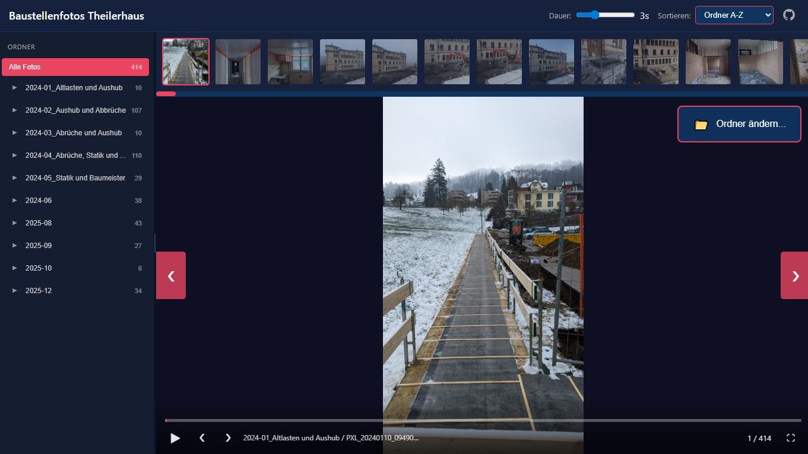

# Glimpse

[](https://opensource.org/licenses/MIT)
[](https://developer.mozilla.org/en-US/docs/Web/HTML)
[](https://developer.mozilla.org/en-US/docs/Web/CSS)
[](https://developer.mozilla.org/en-US/docs/Web/JavaScript)
[](https://github.com/davras5/Glimpse)
[](https://github.com/davras5/Glimpse)

A single-file HTML photo gallery for browsing construction site photos organized in folders.



## Features

- **Single HTML file** - No server required, works offline
- **Folder navigation** - Resizable sidebar with folder tree
- **YouTube-style controls** - Play/pause slideshow, progress bar, fullscreen
- **Thumbnail strip** - Quick navigation with horizontal scroll
- **Keyboard shortcuts** - Arrow keys, Space (play/pause), F (fullscreen)
- **Image preloading** - Smooth slideshow with 2 images preloaded ahead
- **Sorting options** - By folder or filename (ascending/descending)
- **Responsive** - Works on desktop and mobile

## Usage

1. Place `Fotogalerie.html` in the parent folder containing your image subfolders
2. Update the `allImages` array in the script with your image paths
3. Open the HTML file in any modern browser

## Structure

```
project-folder/
├── Fotogalerie.html
├── 2024-01_Folder-Name/
│   ├── image1.jpg
│   └── image2.jpg
└── 2024-02_Another-Folder/
    └── image3.jpg
```

## Controls

| Key | Action |
|-----|--------|
| `←` `→` | Previous / Next image |
| `Space` | Play / Pause slideshow |
| `F` | Toggle fullscreen |
| `Esc` | Exit fullscreen |

## License

MIT
